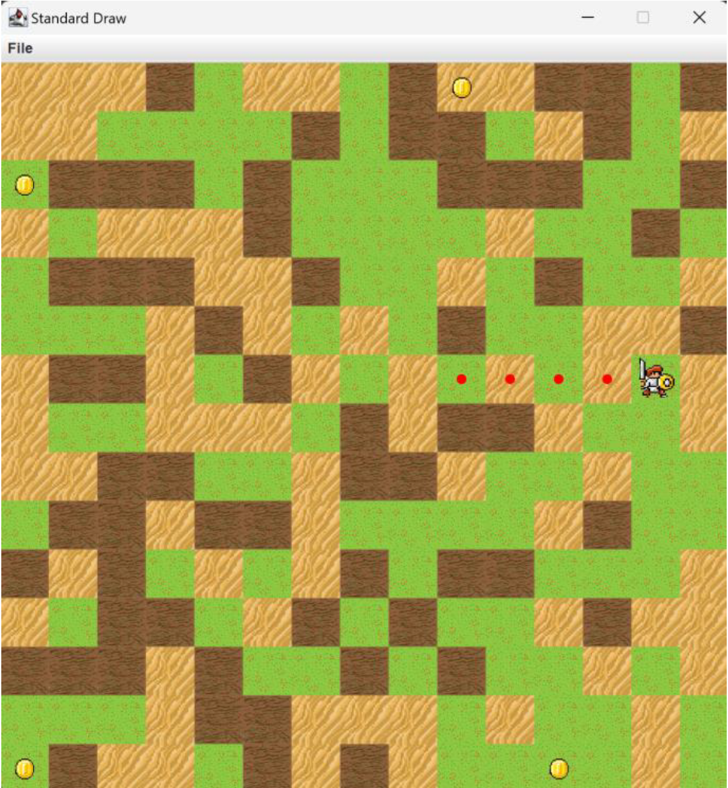

# 🛡️ Gold Trail: Knight's Path Engine
### High-Performance Grid-Based Pathfinding & Real-Time Visualization

**Gold Trail** is a Java-based navigation engine designed to calculate and visualize the most efficient routes on dynamic grid maps with complex terrain costs. The system processes weighted terrain types to determine the shortest paths between a source and multiple objectives sequentially.

<p align="center">
  
  <br>
  <em>Figure 1: Environment visualization</em>
</p>

---

## 🚀 Key Features

* **Advanced Pathfinding:** Minimizes total travel cost from the knight's current position to each gold coin using weighted graph algorithms.
* **Dynamic Terrain & Cost System:** Implements a multi-layered grid:
    * 🌿 **Grass (Type 0):** Low-cost transit (1-5 units).
    * ⏳ **Sand (Type 1):** Mid-cost transit (8-10 units).
    * 🚫 **Obstacle (Type 2):** Impassable tiles with infinite cost.
* **Real-Time Visualization:** Leverages the `StdDraw` library to render maps, terrain textures, and the knight's real-time movement.
* **Sequential Navigation:** Intelligent objective handling—once an objective is reached, it becomes the new starting point for the next target.
* **Robust Error Handling:** Detects unreachable objectives, logs status messages, and proceeds to the next objective without crashing the simulation.

---

## 🏗️ System Architecture

The engine is built on solid **Object-Oriented Programming (OOP)** principles to ensure modularity and scalability:

* **`Tile` Class:** The fundamental building block. Represents map cells, storing grid coordinates $(x, y)$, terrain types, and adjacency data.
* **`PathFinder` Class:** The brain of the engine. Implements the core logic for cost calculation and path optimization between the knight and objectives.
* **`Main` Class:** The orchestrator. Handles file I/O for map data, travel costs, and objective coordinates while managing the primary simulation loop.

---

## 🛠️ Usage & Execution

The program accepts map dimensions, terrain types, costs, and objectives via command-line arguments.

### Requirements
* **Java JDK 8+**
* **stdlib.jar** (Standard Draw library included in the classpath)

### Compilation
```bash
# Compiles all source files and moves class files to the out directory
javac -d out -cp "stdlib.jar" code/*.java
```
### Execution
```bash
# To run the engine with the visualization (draw) flag:
java -cp "out:stdlib.jar" Main -draw mapData.txt travelCosts.txt objectives.txt
```
Note: If the draw flag is not used, only the output file is produced without animation.

## 📊 Performance & Scalability
### Headless & Animated Modes: 
Supports both visual and non-visual execution for batch processing.

### Detailed Logging: 
Generates an output.txt recording every step, 
destination coordinates, 
and cumulative cost for the entire journey.

<p align="center">
  
  <br>
  <em>Figure 1: Logging output</em>
</p>

### Final Statistics: 
Displays total steps and total cost of the entire journey at the end of the output file.

## 📄 Project Report
For a deep dive into the implementation details and class diagrams, you can view the full report here:
[📄 Read the Project Report (PDF)](./report.pdf)

---

*Developed by Melih Efe Sonmez.*
